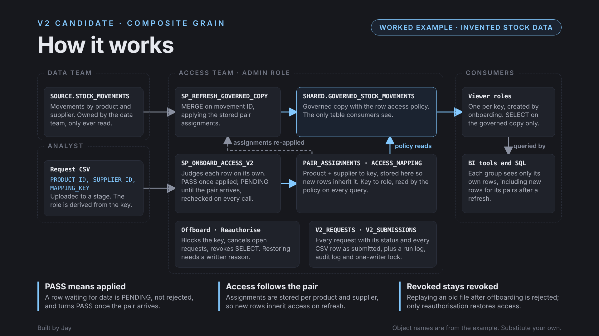

# Row access mapping pattern, V2 candidate

A candidate revision of [`snowflake-row-access-mapping`](../snowflake-row-access-mapping/). It keeps
the same core design (a mapping table and row access policy decide who sees which rows, onboarded
and offboarded from an analyst's CSV, on a governed copy that survives the source being rebuilt) and
adds the controls needed when CSV requests can arrive before the data does and when an interrupted
run must be recovered safely.

## Status

**Candidate.** One worked example, [`examples/composite_grain/`](examples/composite_grain/), passes all
34 of its checks on invented data in a Snowflake trial account (9 October 2026, results in
[`verified-run-2026-10-09.csv`](examples/composite_grain/verified-run-2026-10-09.csv)). Five
behaviours are recorded as NOT TESTED, including the two the single-writer lock and recovery runbook
exist for: two writers at once, and recovering from an aborted session. It stays a candidate until
those are tested.

## What it adds

- A lifecycle tracker: PASS only after an assignment has actually been applied; PENDING for valid
  identifiers not yet in the data; REJECTED, SKIPPED, FAILED and CANCELLED as explicit states.
- Group-level assignments (for example product plus supplier) that are stored durably, so
  new rows for an already assigned group inherit the access.
- A committed single-writer mutex that fails busy instead of stealing a lease, and a recovery
  runbook for interrupted sessions.
- Offboarding that cancels pending work and blocks the key, and an explicit, audited
  reauthorisation step.
- Rules for honest recording: PASS, FAIL and NOT TESTED are reported separately, and a restricted
  session that cannot assume the viewer role is NOT TESTED.

## Worked example

Invented stock movements (2,000 rows to start) with access assigned per product and supplier pair.
The walkthrough records what each step actually saw, including what each viewer role saw with
secondary roles off, and the assertions compare that with counts taken independently from the source
table.

| Step | What it shows |
|---|---|
| 1 | A CSV with two pairs already in the data and one not yet: 2 PASS, 1 PENDING |
| 2 | A viewer sees exactly its pair's rows and nothing else |
| 3 | Re-submitting the identical file: all 3 rows SKIPPED, nothing changes |
| 4 | The missing pair's rows arrive; the next onboarding call moves it to PASS and its viewer sees them |
| 5 | New rows for an assigned pair reach its viewer after a refresh, with no new CSV |
| 6 | Malformed rows and a conflicting assignment are REJECTED, each with a reason |
| 7 | Offboarding blocks the key, removes the mapping, cancels its requests and revokes `SELECT` |
| 8 | Replaying the original file after offboarding is REJECTED and does not restore access |
| 9 | Reauthorising with a reason restores access and increments the key's generation |

NOT TESTED, and why: two writers at once and an aborted session (both need a second session), a
session that is not allowed to switch to the viewer role, the viewer's actual authorisation error
after offboarding (it would stop a Run All; the `SELECT` revocation behind it is checked in step 7),
and the refresh task, which is created suspended.

To run it: `99_teardown.sql`, then `01_setup.sql` to `04_assertions.sql` in order, with 03 and 04 in
one worksheet session. The scripts switch between `ACCOUNTADMIN`, the admin role and the viewer roles,
grant the current user the viewer roles for testing, and use the `COMPUTE_WH` warehouse.

The first runs of this example found six Snowflake behaviours that broke the procedures or the test.
They are recorded in section 10 of the pattern doc.

## Using it

Upload this folder to `.snowflake/cortex/skills/` in a Cortex Code workspace in Snowsight, start a
new chat there and invoke `snowflake-row-access-mapping-v2-candidate`. It needs no CLI: it works
from the available authenticated session, or delivers runnable worksheet SQL labelled unexecuted.

## Files

| File | What it holds |
|---|---|
| `SKILL.md` | Design decisions to settle, implementation steps, verification and handover rules |
| `references/pattern-design.md` | The full design: identity, refresh, lifecycle contract, offboarding, release gate, hardening lessons |
| `references/operating-procedures.md` | Request files, submit and review, offboard, refresh, privilege troubleshooting, session-abort recovery |
| `references/build-record-template.md` | The build record the skill writes at the end of every build |
| `references/build-record-generic.md` | A filled-with-placeholders build record showing the expected shape |
| `examples/composite_grain/` | The worked example: setup, objects, walkthrough, assertions, teardown, the verified run and its diagram |

All names in the generic build record are placeholders. Nothing here contains a real organisation,
account or record value.
