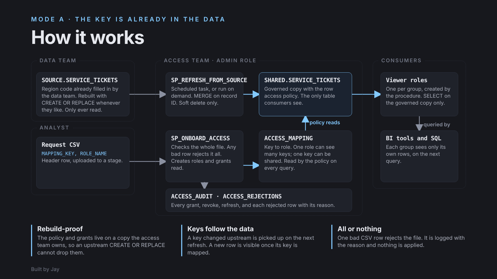
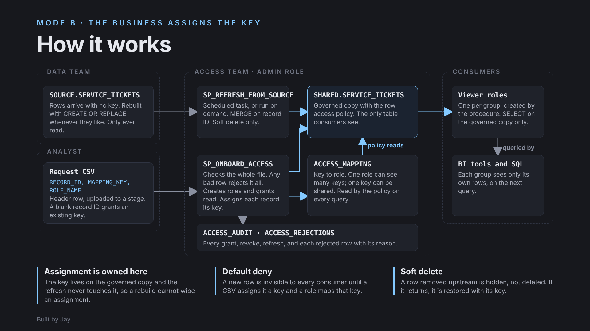

# Row access mapping pattern

A Snowflake pattern, packaged as a skill, for sharing one table with several groups so that each
sees only its own rows, granting and removing that access safely from a CSV with an audit trail, and
keeping it all intact when the table's owner rebuilds it.

## The problem

One dataset, many audiences. Each division, region or partner should see its own slice and nothing
else, often through a BI tool on a live connection, where there is no report-level filtering to
lean on. Hand-written grants and per-group views don't scale and are hard to audit. And when another
team owns the table and may run `CREATE OR REPLACE` on it, any policy or grant attached to it
vanishes with it. I designed this pattern for exactly that need in my own data engineering work,
proved it end to end through a live BI connection, and generalised it here.

## The core idea: access is data

Who can see which rows lives in one governed mapping table. A row access policy on the shared table
checks it on every query:

```sql
IS_ROLE_IN_SESSION('<ADMIN_ROLE>')
OR (REMOVED IS NULL AND EXISTS (
     SELECT 1 FROM GOVERNANCE.ACCESS_MAPPING m
     WHERE m.MAPPING_KEY = KEY_VALUE AND IS_ROLE_IN_SESSION(m.ROLE_NAME)))
```

Granting or removing access is a row change made by an audited procedure, and it takes effect on the
very next query. Default deny: a role with `SELECT` but no mapping sees zero rows.

## Two modes

| | Mode A (common): key already in the data | Mode B: the business assigns the key |
|---|---|---|
| CSV | `MAPPING_KEY, ROLE_NAME` | `RECORD_ID, MAPPING_KEY, ROLE_NAME` |
| Key changes upstream | Followed on the next refresh | Ignored; assignments are owned here |
| New row | Visible once its key is mapped | Invisible until a CSV assigns it |
| Example | [`examples/keyed_column/`](examples/keyed_column/) | [`examples/service_tickets/`](examples/service_tickets/) |

### Solution diagrams

| Mode A: key already in the data | Mode B: the business assigns the key |
|---|---|
|  |  |

## Why a governed copy

Consumers never query the other team's table. A governed copy, owned by the access team and refreshed
from the source by a MERGE on a stable record ID, carries the policy and the grants. The other team
can rebuild their table whenever they like; the copy, its policy and every assignment survive. Rows
that vanish upstream are soft-deleted (hidden, key kept) and restored if they return. A refresh
refuses to run against an empty source. The source is only ever read.

## What it builds

| Object | Role |
|---|---|
| Governed copy | The table consumers query, with the policy attached. |
| `ACCESS_MAPPING` | Mapping key to role. Many-to-many: a role can see many keys, a key can be shared. |
| Row access policy | Attached to the governed copy on its key and soft-delete columns. |
| `SP_REFRESH_FROM_SOURCE()` and a refresh task | Merge the source into the copy; the task is scheduled and runnable on demand. |
| `ACCESS_CONFIG` | The agreed key format and role naming convention, as regular expressions. |
| `SP_ONBOARD_ACCESS(file)` | Applies an analyst's CSV: creates roles, grants read access, adds mappings. |
| `SP_OFFBOARD_ACCESS` / `SP_OFFBOARD_ACCESS_FILE` | Removes one mapping or a file of them; drops roles left unused if asked. |
| `ACCESS_REJECTIONS` | Every failing CSV row, with its reason, for observability. |
| `ACCESS_AUDIT` | Every grant, revoke, assignment, role created or dropped, refresh and rejected file. |

Design decisions worth knowing:

- **A request is all or nothing.** Every row is validated before anything changes. One bad row
  rejects the whole file and logs why.
- **Role names never reach dynamic SQL unvalidated.** The naming check is also the injection guard;
  the examples prove a `DROP TABLE` smuggled in as a role name is refused.
- **Admins run it by hand, deliberately.** Access changes are infrequent and security-sensitive. The
  pattern doc covers automating it later and what that does to the security boundary.
- **Offboarding removes access, not data.** Mappings are removed only by offboarding, never by a
  refresh or an upstream rebuild.
- **Role hierarchy is a decision.** New roles are granted to `SYSADMIN`, standard practice, which
  means system administrators see all mapped rows. The examples test that explicitly.
- **Every build ends with a build record.** The skill writes a `BUILD_RECORD.md` covering what was
  built, every decision, every object, what was tested, and a handover checklist.

One trap is called out in the pattern doc: if the policy's argument shares a name with a mapping
table column, the lookup silently compares the column with itself and every role sees every row.

Full specification: [`references/pattern-design.md`](references/pattern-design.md).
Administrator runbook: [`references/operating-procedures.md`](references/operating-procedures.md).
Build record template: [`references/build-record-template.md`](references/build-record-template.md).

## Verified live

Both examples are complete instances on an invented field-service dataset. Each onboards from real
staged CSVs, rejects a file that breaks every rule, looks at the data through each role with secondary
roles off, survives the source table being replaced, soft-deletes and restores a record, and offboards
singly and in bulk. Each ends in PASS/FAIL assertions, one row per claim.

To run one: run `99_teardown.sql`, then `01_setup.sql` to `04_assertions.sql` in order in one worksheet
session as `ACCOUNTADMIN`.

## Out of scope

Assigning roles to users, warehouse access and authentication are each consumer's own onboarding
process. The pattern ends at "this role can see these rows".

## Known limits

- One mapping key column per table, and one protected table per instance.
- The governed copy is a periodic snapshot, not real time; the refresh can be run on demand.
- Keys must already exist in the data before access to them can be granted.
